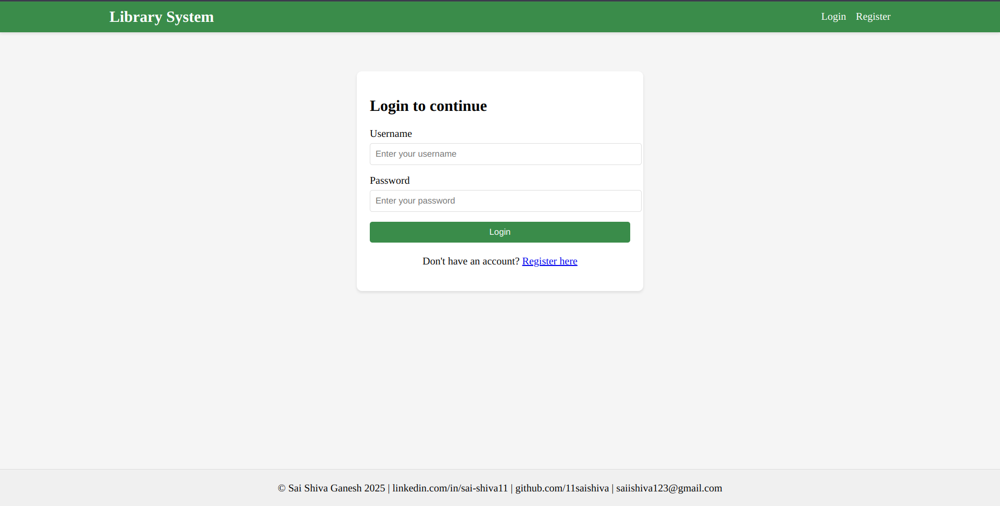
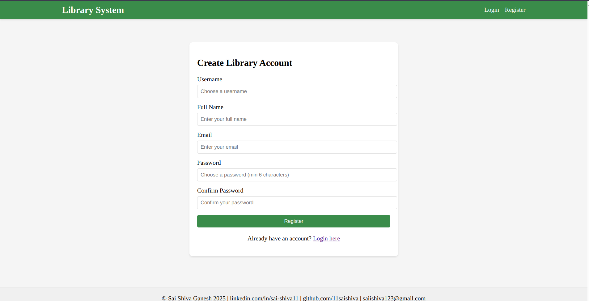
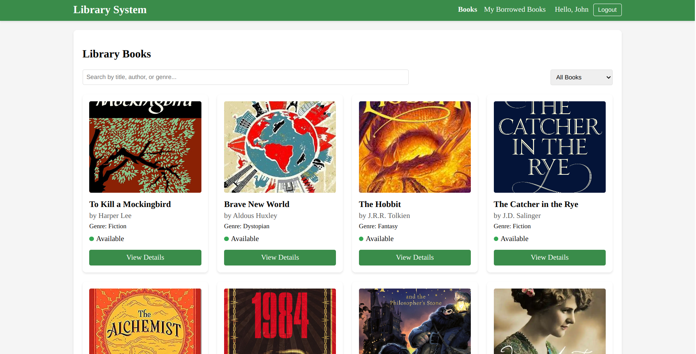
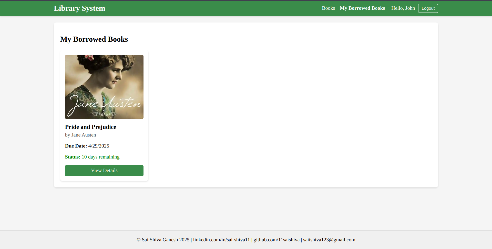

# Library Management System

A React-based library management system for managing library resources, users, and tracking of books.

## Overview

This Library Management System provides a comprehensive solution for libraries to digitize their operations. It features an intuitive user interface for both librarians and members, allowing for easy book browsing, borrowing, returning, and maintaining.

## Tech Stack

### Frontend
- React.js
- CSS
- React Context API
- React Router

### Backend
- React-router-dom
- Supabase(database)

## Setup Instructions

### Prerequisites
- Node.js (v14.x or higher)
- npm (v6.x or higher)

### Installation

1. Clone the repository:
   ```bash
   git clone https://github.com/11saishiva/Library_Management_System.git
   cd library-management-system
   ```

2. Install dependencies:
   ```bash
   npm install
   ```

3. Start the development server:
   ```bash
   npm start
   ```

4. Open [http://localhost:3000](http://localhost:3000) in your browser to view the application.

### Running Tests

```bash
npm test
```
## Database Schema - Library Management System

This document outlines the database schema used in the Library Management System. The system is structured around three main tables: `books`, `users`, and `borrowed_books`.

### Books

Stores information about all the books available in the library.

| Column        | Type      | Description                     |
|---------------|-----------|---------------------------------|
| id            | `uuid`    | Primary key (unique book ID)    |
| title         | `text`    | Title of the book               |
| author        | `text`    | Author of the book              |
| genre         | `text`    | Genre/category of the book      |
| year          | `int4`    | Year of publication             |
| isbn          | `text`    | ISBN number                     |
| description   | `text`    | Description or summary          |
| cover_image   | `text`    | URL or path to cover image      |
| available     | `bool`    | Availability status (true/false)|
| created_at    | `timestamptz` | Timestamp when added        |

### Users

Stores user information for authentication and borrowing.

| Column     | Type      | Description                      |
|------------|-----------|----------------------------------|
| id         | `uuid`    | Primary key (unique user ID)     |
| username   | `text`    | Unique username                  |
| password   | `text`    | Hashed password                  |
| name       | `text`    | Full name of the user            |
| email      | `text`    | User email address               |
| created_at | `timestamptz` | Timestamp when account created|

### Borrowed_books

Tracks the borrowing activity of users.

| Column         | Type        | Description                               |
|----------------|-------------|-------------------------------------------|
| id             | `uuid`      | Primary key                               |
| book_id        | `uuid`      | Foreign key to `books.id`                 |
| user_id        | `uuid`      | Foreign key to `users.id`                 |
| borrowed_date  | `timestamptz` | Date when the book was borrowed        |
| due_date       | `timestamptz` | Expected return date                   |
| returned_date  | `timestamptz` | Actual return date (null if not returned)|
| created_at     | `timestamptz` | Timestamp when the entry was recorded    |

#### Relationships

- A `user` can borrow multiple `books`, tracked via the `borrowed_books` table.
- A `book` can be borrowed multiple times, each tracked as a separate entry in `borrowed_books`.
- `borrowed_books.book_id` → references `books.id`
- `borrowed_books.user_id` → references `users.id`

> All `uuid` fields are automatically generated, and all `timestamptz` fields store timestamps with timezone support.

## User Roles

### Member (Regular User)

A general library member who can browse and borrow books.

#### Permissions:
- Register and log in to the system
- View and search available books
- View book details
- Borrow available books
- View personal borrowing history
- Return borrowed books

### Librarian (Admin)- Future Role Expansion(Planned)

The administrator or librarian manages the entire system and has full access to all features and data.

#### Permissions:
- Add, update, or delete books
- View all borrowed books and user histories
- Mark books as returned
- Manage availability of books
- Access full user list and borrowing data
- View overdue books and apply fines
- Access admin dashboard and analytics

## Features

### Authentication and User Management
- User registration
- Login functionality

### Book Management
- Comprehensive book listing
- Detailed book information view
- Individual book item display

### Borrowing System
- Track borrowed books
- Borrowing and returning functionality

### User Interface
- Responsive navigation bar

## Future Enhancements

1. **Admin Dashboard**: Create a comprehensive dashboard for librarians with analytics on book circulation, and overdue books.

2. **Notification System**: Add email/SMS notifications for due dates, reservation availability, and library announcements.

3. **Book Recommendations**: Add a recommendation engine based on user reading history and preferences.

4. **Mobile Application**: Develop a companion mobile app for easier access on the go.
   
5. **QR Integration**: Add support for QR code scanning for quick book check-in/check-out.

## Gallery 

### Login Page


### Register Page


### Home Page


### My Borrowed Books Page



## Author

Sai Shiva Ganesh
